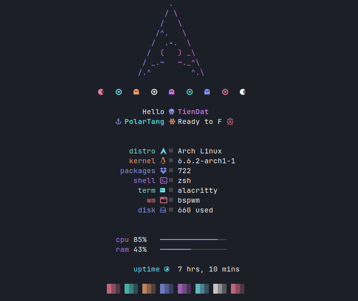
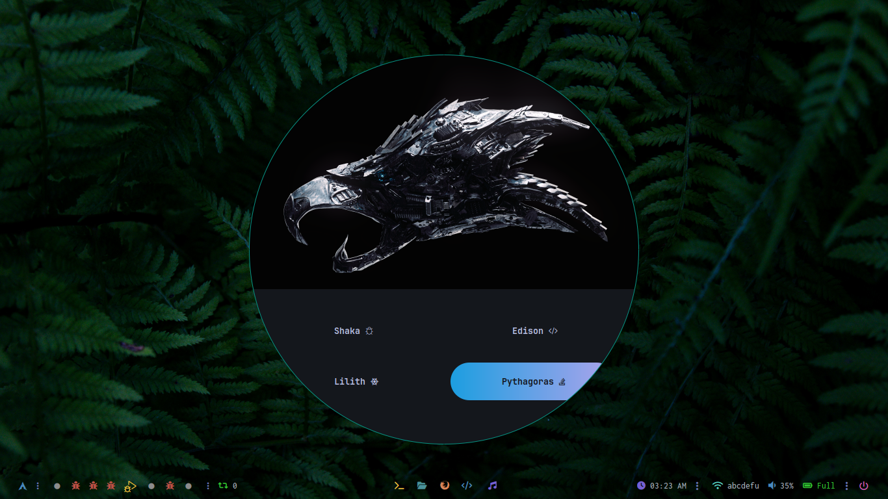
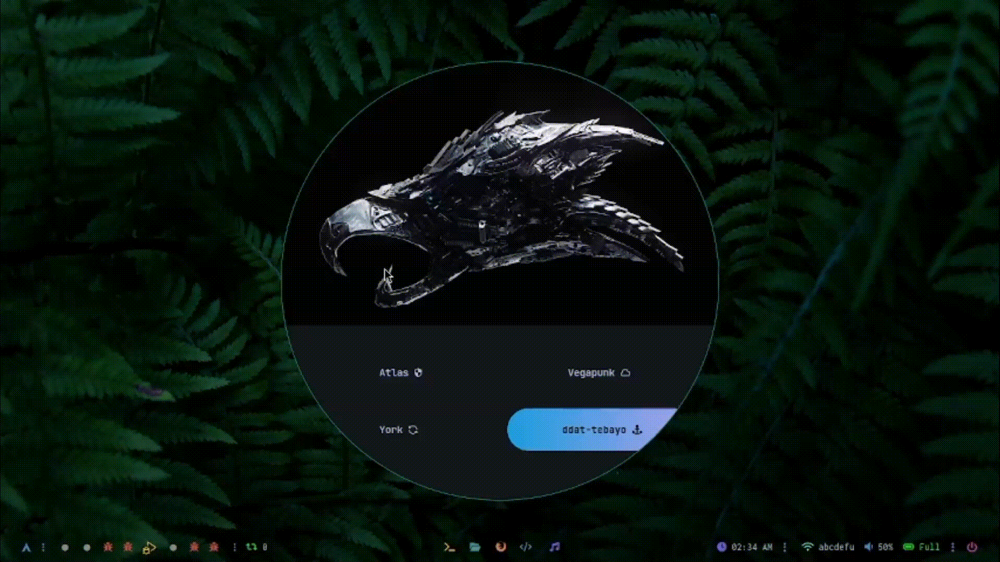
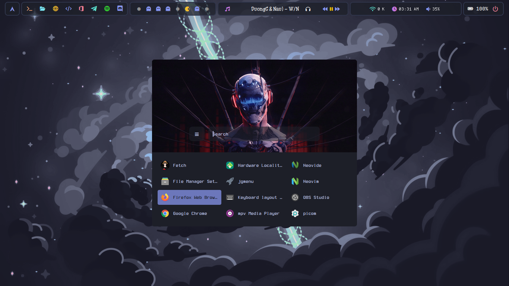
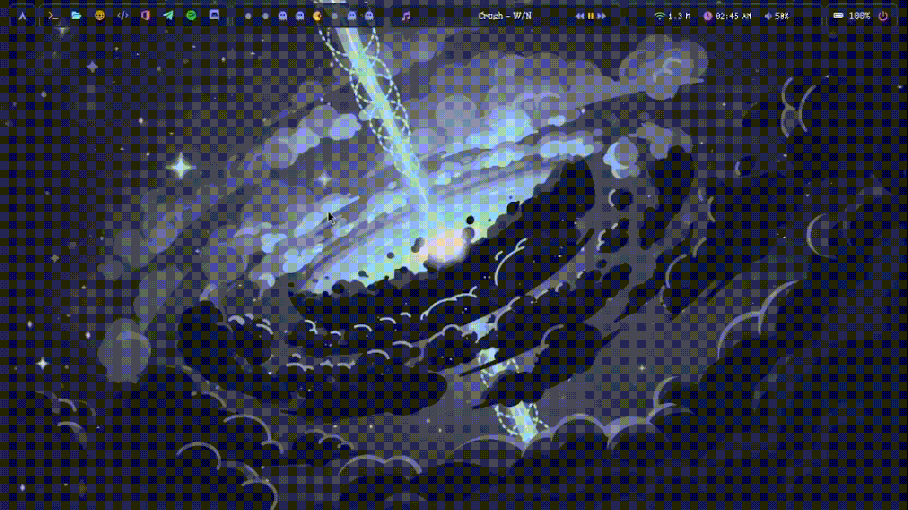
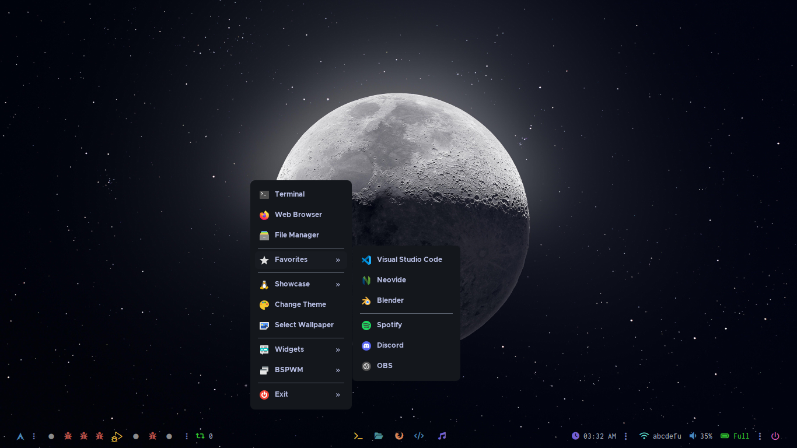
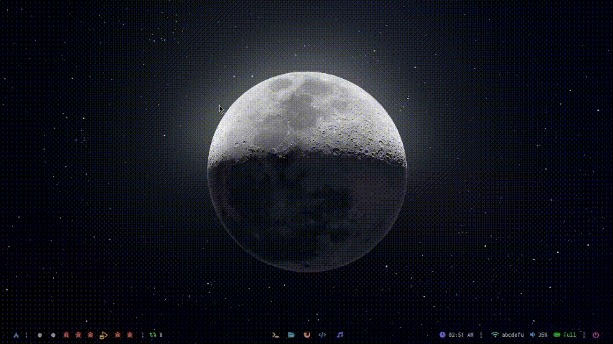

<!-- BADGES -->

&ensp;

&ensp;

&ensp;

# ddat-tebayo dotfiles

## 🌿 Information

|Feature|Package|
|:---:|:---:|
|Window Manager|[bspwm](https://github.com/baskerville/bspwm)|
|Bar|[polybar](https://github.com/polybar/polybar)|
|Shell|[zsh](https://archlinux.org/packages/extra/x86_64/zsh/)|
|Editor|[neovim](https://github.com/neovim/neovim)| 
|Application Launcher|[rofi](https://github.com/davatorium/rofi)|
|Application Menu|[jgmenu](https://github.com/jgmenu/jgmenu)|
|Compositor|[picom](https://archlinux.org/packages/community/x86_64/picom/)|
|Terminal|[alacritty](https://github.com/alacritty/alacritty)|
|Widgets|[ElKowars wacky widgets ](https://github.com/elkowar/eww)|
|Music/Player|[mpd ](https://archlinux.org/packages/extra/x86_64/mpd/)-[ ncmpcpp](https://archlinux.org/packages/community/x86_64/ncmpcpp/)|
|File Manager|[ranger](https://archlinux.org/packages/extra/x86_64/thunar/)|

 

<table align="center">
   <tr>
      <th align="center">
         ⚠️ WARNING ⚠️
      </th>
   </tr>
   <tr>
      <td align="center">
      
      
      
     This dotfiles are configured at 1366x768 resolution with 96 DPI. Some stuff might break on lower or higher resolutions, but still work!!
     
   </tr>
</table>

## 📷 Showcase

<b> 👕 Theme Selector </b>

<b> 👾 Application Launcher </b>

<b> ⚓ Application Menu  </b>

<b> 🌾 Rice Themes </b>

   #### 🎨 Shaka
   #### 🎨 Lilith
   #### 🎨 Edison
   #### 🎨 Pythagoras
   #### 🎨 Atlas
   #### 🎨 York
   #### 🎨 Vegapunk
   #### 🎨 ddat-tebayo
   

## ✨ Credits
- [gh0stzk](https://github.com/gh0stzk/) - The world of limitless customization with gh0stzk's dotfiles (a unique and exciting experience with 15 different themes, each featuring captivating color schemes, styles and personality.)
- [KidP2H](https://github.com/kidp2h/) - Beautiful theme with transparent-glassy-vibrant elements.
