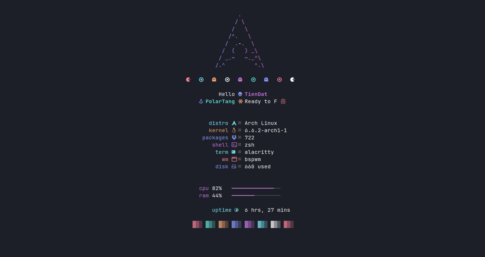

<!-- BADGES -->

&ensp;

&ensp;

&ensp;

# ddat-tebayo dotfiles

## 🌿 Information

|Distro|[Arch](https://archlinux.org/)|
|:---:|:---:|
|WM|[bspwm](https://github.com/baskerville/bspwm)|
|Bar|[polybar](https://github.com/polybar/polybar)|
|Shell|[zsh](https://archlinux.org/packages/extra/x86_64/zsh/)|
|Editor|[neovim](https://github.com/neovim/neovim)| 
|Menu|[rofi](https://github.com/davatorium/rofi)|
|Compositor|[picom](https://archlinux.org/packages/community/x86_64/picom/)|
|Terminal|[alacritty](https://github.com/alacritty/alacritty)|
|Widgets|[ElKowars wacky widgets ](https://github.com/elkowar/eww)|
|Music/Player|[mpd](https://archlinux.org/packages/extra/x86_64/mpd/)-[ncmpcpp](https://archlinux.org/packages/community/x86_64/ncmpcpp/)|
|File Manager|[ranger](https://archlinux.org/packages/extra/x86_64/thunar/)|

 

<table align="center">
   <tr>
      <th align="center">
         ⚠️ WARNING ⚠️
      </th>
   </tr>
   <tr>
      <td align="center">
      
      
      
     THIS DOTFILES ARE CONFIGURED AT 1366x768 WITH 96 DPI! 1 MONITOR
     SOME STUFF MIGHT BREAK ON LOWER OR HIGHER
     RESOLUTIONS BUT WILL STILL WORK!
     
   </tr>
</table>